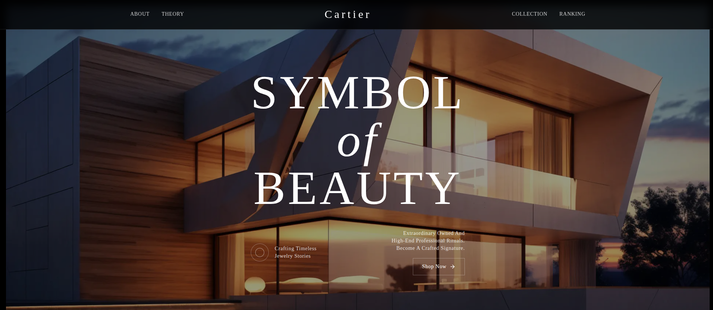

  

# 🏠 Real Estate Developer UI Template — Next.js + Tailwind CSS

A frontend-only UI template built with Next.js 15 and Tailwind CSS, designed specifically for real estate developers. This template provides a clean, modern interface with minimal animations — perfect for dashboards, property listings, or admin panels.

## ⚙️ Tech Stack
- **Framework**: Next.js (App Router)  
- **Styling**: Tailwind CSS 3, Tailwind Merge  
- **UI Components**: Radix UI (accessible & unstyled), Lucide Icons  
- **Form Handling**: React Hook Form + Zod  
- **Charts & Dates**: Recharts, date-fns  
- **Theming**: Dark mode via next-themes  
- **Type-safe**: Built with TypeScript  

## ✅ Features
- 🎯 Frontend-only: No backend or DB integration included  
- 📦 Pre-styled components for real estate dashboards  
- 📱 Responsive layout, mobile-first design  
- 🌙 Light/Dark theme support  
- ⚡ Minimal animations for a clean user experience  
- 🧩 Modular code structure with reusable components  

## 🧱 Ideal Use Cases
- Real estate admin dashboards  
- Property listing UI  
- Static frontend for real estate SaaS  
- Prototype for client-facing tools  
